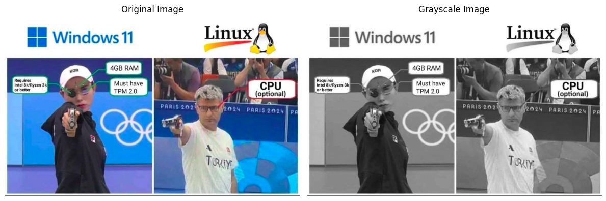
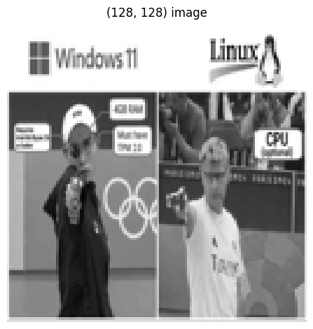
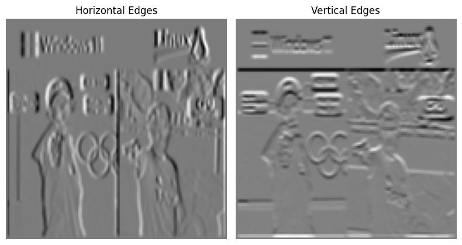
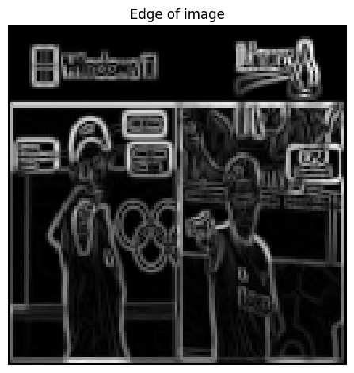
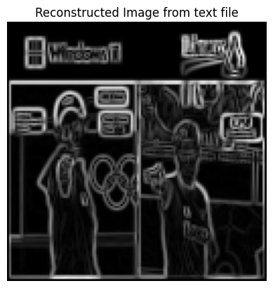
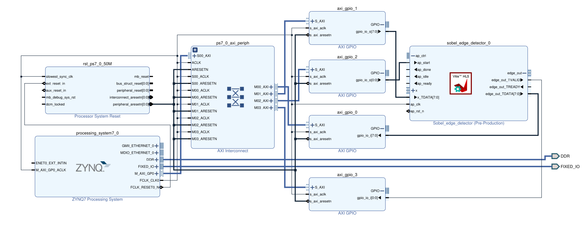

# Edge Detector HW/SW Co-design on FPGA


In this project, the Sobel edge detection algorithm has been implemented at a high level on an FPGA. The design follows a co-design approach, where:

* The computation tasks are offloaded to the PL (Programmable Logic) part of the FPGA.
* The interface and I/O handling are managed by the PS (Processing System).

The implementation is carried out on the `ZynQ 7010` chip, which provides an efficient platform for hardware/software co-design. This combination leverages the high-performance processing capabilities of hardware with the flexibility of software to achieve an optimized edge detection solution.


## Features
- Sobel Edge Detection algorithm implementation.
- Hardware acceleration using ZynQ 7010.
- AXI-based communication between PL and PS.
- Image resizing and processing for optimized performance.


## Getting Started

### Prerequisites
To clone and run this project, ensure you have the following tools installed:
- **Vivado** (with HLS and Vitis)
- **C++ Compiler** (e.g., GCC or Clang)
- Python (for optional image visualization)

### Cloning the Repository
To clone the repository, run:
```bash
git clone https://github.com/rezaAdinepour/Edge-Detector-Co-Design.git

cd Edge-Detector-Co-Design
```


### Sobel Edge Detection Algorithm

The Sobel edge detection algorithm is a popular and straightforward method used in image processing to identify edges in an image. It works by detecting regions of high intensity gradients, which typically correspond to edges in the image.

#### Key Concepts:

1. **Edge Detection**:  
   Edges in an image are boundaries where there is a sharp change in pixel intensity, often indicating object boundaries or other features.

2. **Gradient**:  
   The Sobel algorithm calculates the gradient of image intensity at each pixel, providing both the magnitude and direction of edges.

#### How Sobel Works:

1. **Gradient Calculation**:  
   Sobel applies two filters (kernels) to the image: one for detecting changes in the horizontal direction (**Gx**) and another for the vertical direction (**Gy**). These filters are convolution masks:

   - Horizontal filter (**Gx**):  

$$
     G_x =
     \begin{bmatrix}
     -1 & 0 & 1 \\
     -1 & 0 & 1 \\
     -1 & 0 & 1
     \end{bmatrix}
$$

   - Vertical filter (**Gy**):  

$$
     G_y =
     \begin{bmatrix}
     -1 & -1 & -1 \\
      0 &  0 &  0 \\
      1 &  1 &  1
     \end{bmatrix}
$$

2. **Convolution**:  
   The image is convolved with these filters. Each filter emphasizes changes in intensity in its respective direction.

3. **Gradient Magnitude**:  
   The gradients from the horizontal and vertical filters are combined to compute the overall edge strength at each pixel using the formula:

$$
    \text{Gradient Magnitude} = \sqrt{G_x^2 + G_y^2}
$$

4. **Gradient Direction**:  
   The direction of the edge can be determined using:

$$
    \theta = \tan^{-1}\left(\frac{G_y}{G_x}\right)
$$

5. **Thresholding** (optional):  
   To identify only significant edges, a threshold can be applied to the gradient magnitude.

#### Characteristics of Sobel Algorithm:

- **Noise Sensitivity**:  
  Sobel includes smoothing (averaging) in its kernel structure, which reduces the impact of noise compared to simpler methods like Prewitt filters.
  
- **Performance**:  
  It is computationally efficient and suitable for hardware implementation like on FPGA.

- **Applications**:  
  Sobel is commonly used in computer vision tasks, such as object detection, feature extraction, and motion analysis.


We design the project in two phases:
- software 
- hardware

## Software Phase:
For testing the design, we use the following image:




* We convolve the two kernels **Gx** and **Gy** with the image and then calculate the average of the outputs of both convolved images to report the edges of the image.

To achieve this, we implement the convolution function as follows:

```Python
def convolve(x, kernel):
    x_height = x.shape[0]
    x_width = x.shape[1]
    
    kernel_height = kernel.shape[0]
    kernel_width = kernel.shape[1]
    
    H = (kernel_height - 1) // 2
    W = (kernel_width - 1) // 2
    
    out = np.zeros((x_height, x_width))
    # iterate over all the pixel of image X
    for i in np.arange(H, x_height - H):
        for j in np.arange(W, x_width - W):
            sum = 0
            # iterate over the filter
            for k in np.arange(-H, H + 1):
                for l in np.arange(-W, W + 1):
                    # get the corresponding value from image and filter
                    a = x[i + k, j + l]
                    w = kernel[H + k, W + l]
                    sum += (w * a)
            out[i, j] = sum
    return out

```

* The dimensions of the grayscale image are (1080, 661).
* To reduce computational load and increase processing speed, we compromise on image quality and downscale the image dimensions to (128, 128).
* The resized image appears as follows:




Next, we convolve both kernels with the input image, and the outputs are as follows:




Using the code snippet below, we compute the average of the edges detected by both kernels. We then normalize the pixel values to a range of 0 to 255.

```Python
# calculate the gradient magnitude of vectors
edge_out = np.sqrt(np.power(pre_x, 2) + np.power(pre_y, 2))
edge_out = (edge_out / np.max(edge_out)) * 255
```


The final edge-detected image, referred to bellow, is presented as the software output of the edges detected in the image.




## Hardware Phase:
In the hardware phase of the project, the same steps are repeated to allow us to compare the outputs of both phases.

For this phase, we used HLS (High-Level Synthesis) to write the hardware implementation. Due to the lengthy code, it is not included in the report, but you can find it in the file sobe`l_edge_detector.cpp` located at:

```bash
Codes/HW/Sobel_Edge_Detector_PL/src
```

The testBench file for the module is also available in the same directory. The test file is written such that it:

* Reads the pixel values of the grayscale image from the file `Linux.txt`.
* Executes the algorithm.
* Saves the result to the file `edge_linux_hls.txt`.

Finally, this output file is converted back into an image and displayed as follows:

```Python
img_array = np.loadtxt("Data/Linux.txt", dtype=np.uint8)
img = Image.fromarray(img_array)

print("image shape: {}" .format(img_array.shape))
```




In the next step, we need to establish communication between PL (Programmable Logic) and PS (Processing System).

To achieve this:

1. We export the module written in `HLS` as an `IP Core` and integrate it into Vivado.

2. For enabling this communication, we utilize `AXI_GPIO` blocks.
    - Two blocks are used for transferring data (image) to the `PL` and receiving the processed data back from the `PL`.
    - Two additional blocks are used as control signals, which are explained in the relevant section.

The final design structure is presented as follows:




Finally, after establishing the connection between `PL` and `PS`, we created a Wrapper file in Vivado. The communication was successfully set up as follows in Vitis.


```C
int main()
{
    init_platform();

    XGpio data_input, data_output;
    XGpio start, valid;

    unsigned char edge[ROWS][COLS];

    // GPIO 1, 2: output,
    // GPIO 0, 3: input
    XGpio_Initialize(&data_input, XPAR_AXI_GPIO_0_DEVICE_ID);
    XGpio_Initialize(&valid, XPAR_AXI_GPIO_3_DEVICE_ID);
    XGpio_Initialize(&data_output, XPAR_AXI_GPIO_1_DEVICE_ID);
    XGpio_Initialize(&start, XPAR_AXI_GPIO_2_DEVICE_ID);

    // 0: output, 1: input
    XGpio_SetDataDirection(&data_input, 1, 1);
    XGpio_SetDataDirection(&valid, 1, 1);
    XGpio_SetDataDirection(&data_output, 1, 0);
    XGpio_SetDataDirection(&start, 1, 0);

    while(1)
    {
    	if(XGpio_DiscreteRead(&valid, 1) == 1)
    	{
    		for(int i  = 0; i < ROWS; i++);
			{
				for(int j = 0; j < COLS; j++)
				{
					XGpio_DiscreteWrite(&data_output, 1, x[i][j]);
				}
			}
			XGpio_DiscreteWrite(&start, 1, 1);
    	}
    	else
    	{
    		if(XGpio_DiscreteRead(&start, 1) == 1)
    		{
    			XGpio_DiscreteRead(&data_input, 1);
    		}
    		else
    		{

    		};
    	}

    }

    // print("Hello World\n\r");
    // print("Successfully ran Hello World application");
    // cleanup_platform();


    return 0;
}
```


In this code, the grayscale image is hardcoded as a 2D array.

Then, using two control signals, valid and start, the transmission and reception of the image between **PL** (Programmable Logic) and **PS** (Processing System) are controlled.

The process works as follows:

* If the user wants to send an image, they must first set the **valid** input signal to `1`.
* The image is then read line by line, and the value of each pixel (8 bits) is sent to the PL.
* After the image is fully transmitted, the **start** signal is set to `1`. This indicates that the algorithm can begin processing.

Once the edges are detected in the **PL**, the processed data is sent back to the **PS** as an 8-bit stream.


## Contribution
Feel free to contribute to this project by submitting issues or pull requests. Any improvements or additional features are welcome!


## License
This project is licensed under the MIT License. See the `LICENSE` file for more details.


## Contact
For any questions or further information, contact [r3zaadinep0ur@gmail.com](r3zaadinep0ur@gmail.com).
